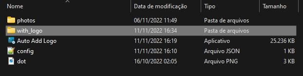

>
> ### This project was developed to add a logo to all photos in a directory
> ## How to use
> 1 - Select a logo file png or jpg 
>
> 
>
> 2 - Select a image folder
>
> 
> 
> 3 - Select a config file
> 
> 
> 
>                           Done, easy as that
>
> Images are saved in the with logo folder
>
>  
>  
 ---- 
> ## How edit config file
> The default config.json is
> ````json
> {
>    "logo_config":{
>        "logo_size": 100,
>        "logo_angle": 0.2,
>        "x_offset": -50,
>        "y_offset": -50,
>        "logo_position":"bottom_right" 
>    },
>
>    "valid_logo_positions": [
>        "center",
>        "top_left",
>        "top_right",
>        "bottom_left",
>        "bottom_right"
>    ]
>}
> ````
>### Logo Size
> - Used to reduce logo size, 100% is maximum image size 
>-> ``integer value``
>###  Logo Angle
> - Used to rotate the logo -> ``floating value``
>
> ### Offset
> - Used to move the logo from the selected position ->  ``integer value``
> ### Logo Position
> - Use to select a position for the logo -> ``String value``
 --- 
 > Last edit  11/11/2022
 


